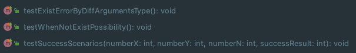
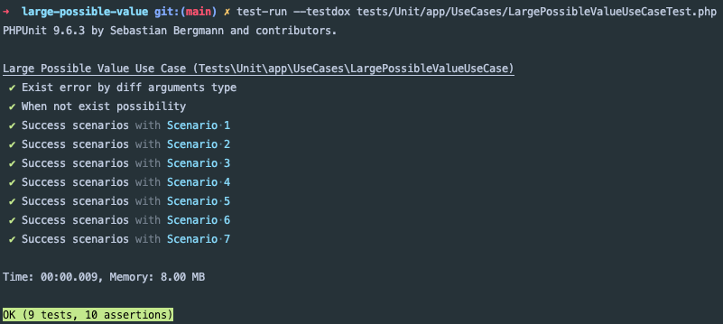
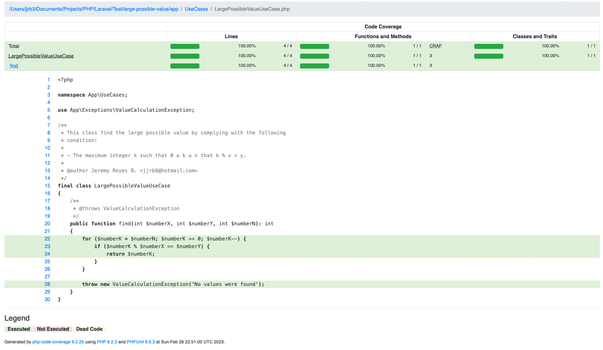
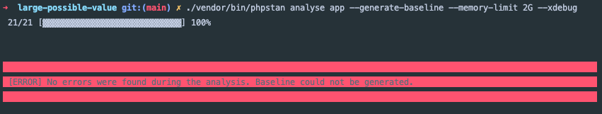
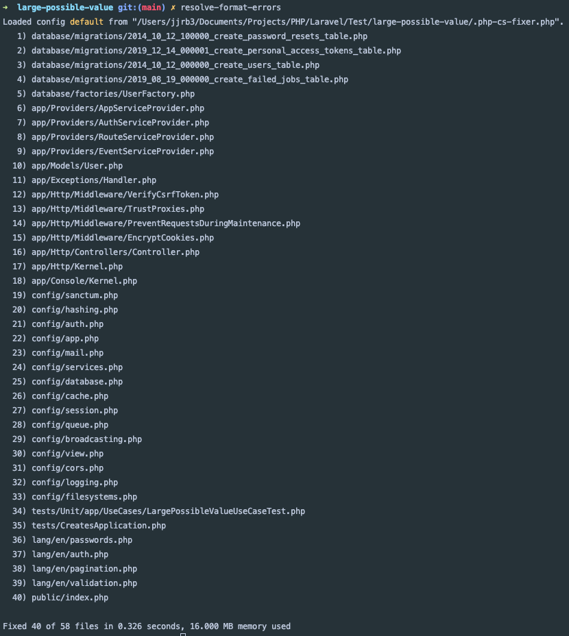

## Posible valor mas grande.

Se resuelve el problema planteado de encontrar el posible valor mas grande que se puede ver a detalle en el siguiente
link:

https://codeforces.com/problemset/problem/1374/A

Para la solución de este problema se utilizó el Framwork Laravel 10. Los requerimientos necesarios para ejecutar
las pruebas de este proyecto son los siguientes:

- PHP 8.0 o superiores.
- Composer 2.5.4 o superiores.
- Generar el archivo `.env` donde debemos hacer la copia de `.env.example` y ejecutar el siguiente comando:

```
php artisan key:generate
```

---

### Archivos creados.

Los archivos generados para la solución de la prueba son los siguientes:

```text
app/UseCases/LargePossibleValueUseCase.php
```

```text
app/Exceptions/ValueCalculationException.php
```

```text
tests/Unit/app/UseCases/LargePossibleValueUseCaseTest.php
```

---

### Test unitarios y cobertura.

En el archivo de pruebas podemos ver los siguientes test:



La ultima prueba `testSuccessScenarios` son los escenarios `input` con su resultado `output`.



Como podemos ver en la imagen:

* Memoria utilizada: 8.00 MB / 256 MB
* Tiempo de ejecución: 00:00:009 / 00:01:000

Se hizo la revisión de la cobertura para el caso de uso creado obteniendo el 100%.



---

### Revisión de estandares.

Se instalo `phpstan` para revisar los errores en linter que tiene el proyecto actual y arreglarlos. Todos los errores
fueron solucionados.



Se instaló `php-cs-fixer` para arreglar los errores de formato que tenga el proyecto y los archivos creados. Fueron 
encontrado y arreglado los siguientes:

