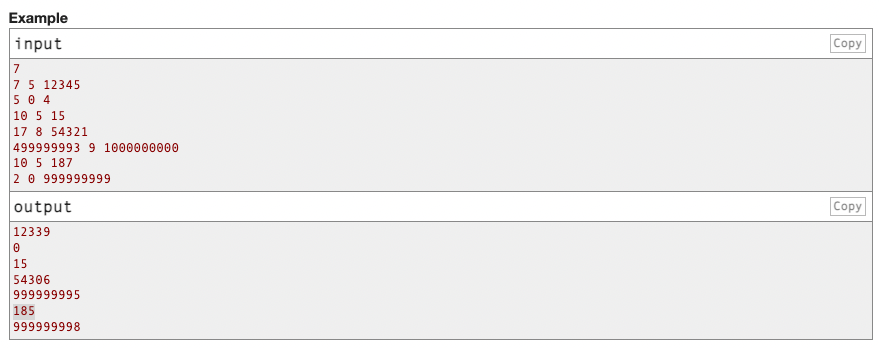

## Posible valor mas grande.

Se resuelve el problema planteado de encontrar el posible valor mas grande que se puede ver a detalle en el siguiente
link:

https://codeforces.com/problemset/problem/1374/A

Para la solución de este problema se utilizó el Framwork Laravel 10. Los requerimientos necesarios para ejecutar
las pruebas de este proyecto son los siguientes:

- PHP 8.0 o superiores.
- Composer 2.5.4 o superiores.
- Phpstan 1.10.
- Php-cs-fixer 3.14.

__NOTA.__ Para poder correr las pruebas debe generar el archivo `.env` donde se debe hacer la copia de `.env.example` 
que se encuentra en la raiz del proyecto y ejecutar el siguiente comando:

```
php artisan key:generate
```

---

### Archivos creados.

Los archivos generados para la solución de la prueba son los siguientes:

```text
app/UseCases/LargePossibleValueUseCase.php
```

```text
app/Exceptions/ValueCalculationException.php
```

```text
tests/Unit/app/UseCases/LargePossibleValueUseCaseTest.php
```

---

### Test unitarios y cobertura.

Se usa [PHPUnit](https://docs.phpunit.de/en/9.6/) para realizar las pruebas. En el archivo de pruebas podemos ver 
los siguientes test:


La ultima prueba `testSuccessScenarios` son los escenarios `input` con su resultado `output`.


| Desafío de la pagina Web                                         | Escenarios generados para el desafío                       |
|------------------------------------------------------------------|------------------------------------------------------------|
|  |  |


Como podemos ver en la imagen:

* Memoria utilizada: 8.00 MB / 256 MB.
* Tiempo de ejecución: 00:00:009 / 00:01:000.

Se hizo la revisión de la cobertura para el caso de uso creado obteniendo el 100%.


---

### Revisión de estandares.

Se instalo [phpstan](https://phpstan.org/user-guide/getting-started) para revisar los errores en linter que tiene el 
proyecto actual y arreglarlos. Todos los errores fueron solucionados.


Se instaló [php-cs-fixer](https://github.com/PHP-CS-Fixer/PHP-CS-Fixer) para arreglar los errores de formato que tenga 
el proyecto y los archivos creados. Fueron encontrado y arreglado los siguientes:


__NOTA.__ Los estandares usados fueron [PSR-12](https://www.php-fig.org/psr/psr-12/). También 
[Clean Code](https://github.com/piotrplenik/clean-code-php) y en lo posible 
[Arquitectura Limpía](http://prof.mau.ac.ir/images/Uploaded_files/Clean%20Architecture_%20A%20Craftsman’s%20Guide%20to%20Software%20Structure%20and%20Design-Pearson%20Education%20(2018)%5B7615523%5D.PDF).

---

### Comando ejecutados sin Alias.

Correr la pruebas en general.
```text
vendor/bin/phpunit tests/Unit/app/UseCases/LargePossibleValueUseCaseTest.php
```

Correr la pruebas detallandolas.
```text
vendor/bin/phpunit tests/Unit/app/UseCases/LargePossibleValueUseCaseTest.php --testdox
```

Generar covertura por HTML.
```text
XDEBUG_MODE=coverage vendor/bin/phpunit tests/Unit/app/UseCases/LargePossibleValueUseCaseTest.php --coverage-html=coverage
```

Revisar errores de linter.
```text
vendor/bin/phpstan analyse app --no-progress --memory-limit 3G > test-reports/static-errors.txt 2> test-reports/static-fatal.txt
```

Corregir errores de formato.
```text
vendor/bin/php-cs-fixer fix
```